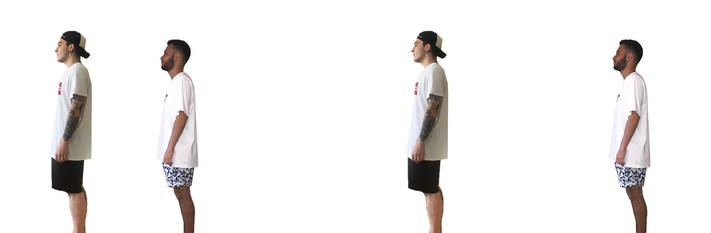
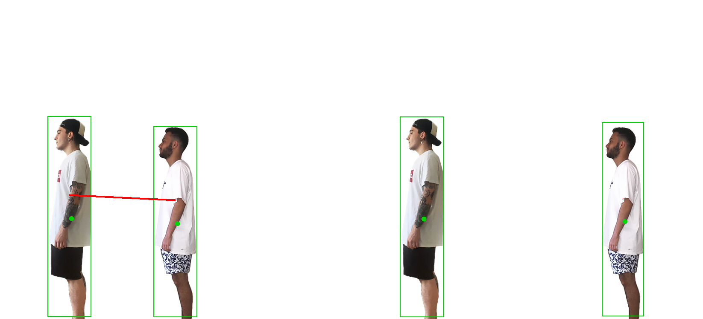
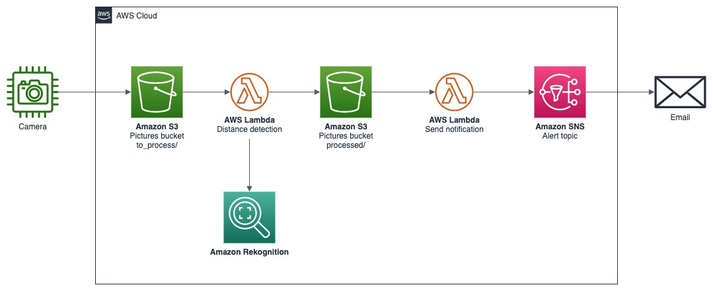

# Rekognition Distance Calculation

This solution explore how to identify non-compliance with guidelines for social distance using Amazon Rekognition, AWS Lambda and Amazon SNS.

<p align="center"> 

</p>

<p align="center"> 

</p>

## Solution Overview

<p align="center"> 

</p>

## Setup Instructions

### Provision the Infrastructure

You just need to run the cloudformation template to provision the infraestructure and all components

1. First you need to create a S3 bucket to store our application lambda code.

``` shell
aws s3 mb s3://<MY_BUCKET_NAME>
```

2. ZIP lambda code.

``` shell
zip ./lambda_package_crowd.zip -j process_distance/*
```

``` shell
zip ./lambda_package_notify.zip -j lambda_sns_notify/*
```

3. Upload the lambda packages to the S3 bucket that we created before.

``` shell
aws s3 cp lambda_package_crowd.zip s3://<MY_BUCKET_NAME>/lambda_code/
```

``` shell
aws s3 cp lambda_package_notify.zip s3://<MY_BUCKET_NAME>/lambda_code/
```

4. Create and upload the lambda layer with Pillow

``` shell
cd pillow-layer
./create_lambda_layer.sh
```

``` shell
aws s3 cp pillow-layer/pillow-layer.zip s3://<MY_BUCKET_NAME>/lambda_layer/
```

5. Now we need to create the stack using our Cloudformation template available in **cloudformation/** folder

``` shell
aws cloudformation create-stack --stack-name crowd-rekognition-stack --template-body file://template/cloudformation.yml --parameters ParameterKey=StackName,ParameterValue=crowd-rekognition-stack ParameterKey=BucketPictures,ParameterValue=<NEW_BUCKET_NAME_PICTURES> ParameterKey=BucketLambdaCode,ParameterValue=<BUCKET_NAME_THAT_WE_PROVISIONED_BEFORE> ParameterKey=SnsSubscriptionEmail,ParameterValue=<YOUR_EMAIL_ADDRESS> --capabilities CAPABILITY_IAM
```

Wait for the stack to be created and test the solution uploading a new image on the S3 Bucket.

## Clean Up

1. Open the CloudFormation console at https://console.aws.amazon.com/cloudformation
2. Select the Stack and click on Delete button
3. Delete the Amazon S3 bucket and AWS Lambda Layer

## Reference Links

* [Utilizando o Amazon Rekognition para identificar aglomerações (Using Amazon Rekognition to identify agglomerations)](https://aws.amazon.com/pt/blogs/aws-brasil/utilizando-o-amazon-rekognition-para-identificar-aglomeracoes/)
* [Uso de Amazon Rekognition para identificar clústeres (Using Amazon Rekognition to identify agglomerations)](https://aws.amazon.com/es/blogs/aws-spanish/uso-de-amazon-rekognition-para-identificar-clusteres/)

## Security

See [CONTRIBUTING](CONTRIBUTING.md#security-issue-notifications) for more information.

## License

This library is licensed under the MIT-0 License. See the LICENSE file.

